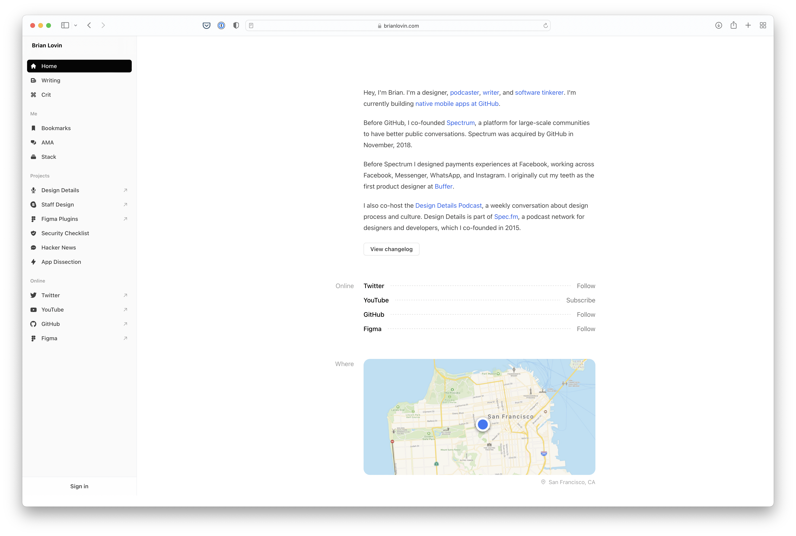

# about-me-v2

Portfolio website including resume, work showcases, and blog posts. Using a combination of svelte-kit and tailwindcss. I'm no designer, but I loved the look of [Brian Lovin's portfolio site](https://brianlovin.com), so I'm using it as inspiration while building out my html/css.



## Developing

```bash
# install dependencies if you haven't already
npm install

# run the application
npm run dev
```

If you are using VSCode, it's recommended to setup your own tasks.json file to trigger these commands

## Building

To create a production version of the app:

```bash
npm run build
```

You can preview the production build with `npm run preview`.

## Deploying

TBD; likely to include the [cloudflare adapter](https://kit.svelte.dev/docs/adapters)
